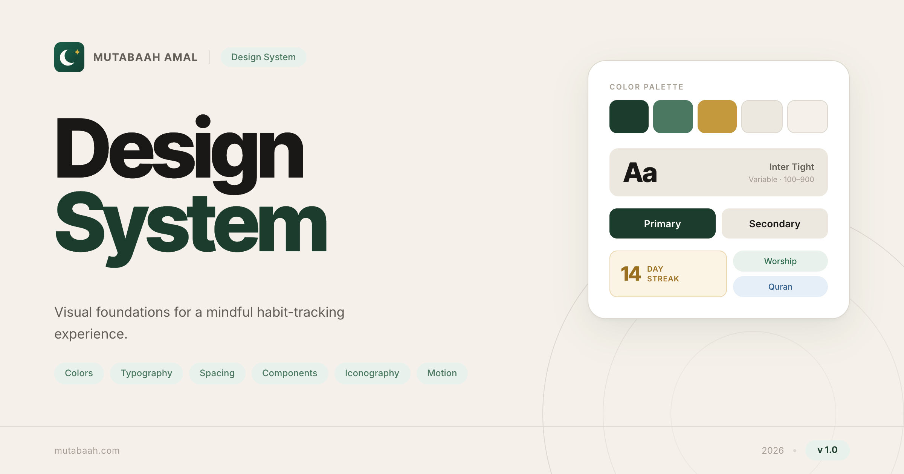

# Mutabaah Amal — Design System

A design system for **Mutabaah Amal**, an Islamic habit and amal tracking app. It documents all visual tokens, components, and interaction patterns used across the product.



## Overview

The design system requires no build step or dependencies. Open `index.html` directly in a browser to browse the living style guide.

```
mutabaah-design-system/
├── index.html          # Design system documentation
├── styles.css          # All styles and design tokens
├── script.js           # Copy-to-clipboard, sticky nav highlighting, icon init
├── og-image.png        # Social share image (1200×630px) — referenced by meta tags
├── favicon-16x16.png
└── favicon-32x32.png
```

## Sections

| # | Section | What it covers |
|---|---------|----------------|
| 01 | **Colors** | Core palette (background, surface, primary, sage, gold) and category colors (Worship, Quran, Charity, Personal) |
| 02 | **Typography** | Inter Tight (display), Inter (body) — full type scale |
| 03 | **Spacing** | Base spacing scale (4–80px) plus component and layout rhythm tables |
| 04 | **Iconography** | Lucide icon library — all icons grouped by category with usage guidance |
| 05 | **Components** | Buttons, chips, tags, input fields, progress rings, bar charts, streak badges |
| 06 | **Tasks** | Task item states (pending, done), metadata, and interaction notes |
| 07 | **Navigation** | Bottom tab bar and dashboard cards (hero card, Hijri date, streak) |
| 08 | **Motion & Tone** | Transition durations, easing curves, animation principles, and copy guidelines |

## Design Tokens

### Color Palette

| Token | Value | Role |
|-------|-------|------|
| `--bg` | `#F5F1EA` | Page background |
| `--surface` | `#FFFFFF` | Card / component surface |
| `--surface-alt` | `#EDE8DF` | Secondary surface, input fill |
| `--border` | `#DDD8CF` | Default border |
| `--primary` | `#1C3D2E` | Primary action, brand green |
| `--sage` | `#4A7860` | Accent / secondary green |
| `--gold` | `#C4993E` | Streak, highlight |
| `--text-1` | `#1A1816` | Primary text |
| `--text-2` | `#635E56` | Secondary text |
| `--text-3` | `#A49E94` | Muted / placeholder text |

### Category Colors

| Category | Color | Background |
|----------|-------|------------|
| Worship (Ibadah) | `#2D6E4E` | `#E8F2EC` |
| Quran | `#2E5D8C` | `#E6EEF7` |
| Charity (Sadaqah) | `#C4993E` | `#FBF3E3` |
| Personal | `#6E4A8C` | `#EFE9F7` |

### Typography

| Font | Use |
|------|-----|
| **Google Sans Flex** | Design system documentation page — all text |
| **Inter Tight** | App display typeface (documented in the Typography section) |
| **Inter** | App body typeface (documented in the Typography section) |

All fonts are loaded from Google Fonts.

### Icons

| Library | Version | Method |
|---------|---------|--------|
| [Lucide](https://lucide.dev) | 0.460.0 | `<i data-lucide="icon-name"></i>` via CDN |

Icons are initialised automatically on page load via `lucide.createIcons()` in `script.js`.

## Social Sharing

`index.html` includes Open Graph and Twitter Card meta tags for rich link previews on social platforms.

| Tag | Value |
|-----|-------|
| `og:title` | Design System — Mutabaah Amal |
| `og:description` | Visual foundations for the Mutabaah Amal progressive web application. |
| `og:image` | `og-image.png` (1200×630px) |
| `twitter:card` | `summary_large_image` |

When deploying, replace the relative `og-image.png` path with an absolute URL so crawlers can fetch it:

```html
<meta property="og:image" content="https://your-domain.com/og-image.png" />
```

## Interactive Features

| Feature | File | Notes |
|---------|------|-------|
| Copy hex to clipboard | `script.js` | Click any hex value in the Colors section; falls back to `execCommand` on HTTP |
| Sticky nav highlighting | `script.js` | Active section is highlighted in the nav as you scroll |
| Icon rendering | `script.js` | Lucide icons are initialised after the CDN script loads |

## Usage

Open `index.html` in any modern browser:

```bash
open index.html
# or
python3 -m http.server 8080
```

No installation, build tools, or package manager required.

## Responsive Breakpoints

| Breakpoint | Width | Changes |
|------------|-------|---------|
| Desktop | > 900px | Full layout, 6-column color grid |
| Tablet | ≤ 900px | Reduced padding, single-column font cards |
| Mobile | ≤ 640px | Compact layout, nav links hidden |
| Small phones | ≤ 380px | Smaller hero type |

## Contributing

| File | Purpose |
|------|---------|
| `index.html` | Structure, content, and meta tags of the style guide |
| `styles.css` | All styles and CSS custom property tokens |
| `script.js` | Interactive behaviour — clipboard, nav highlighting, icon init |

To update design tokens, edit the `:root` block at the top of `styles.css`. To add new sections or components, edit `index.html` and add corresponding styles to `styles.css`. To replace the social share image, swap out `og-image.png` (keep it at 1200×630px) and update the `og:image` meta tag URL if needed.
