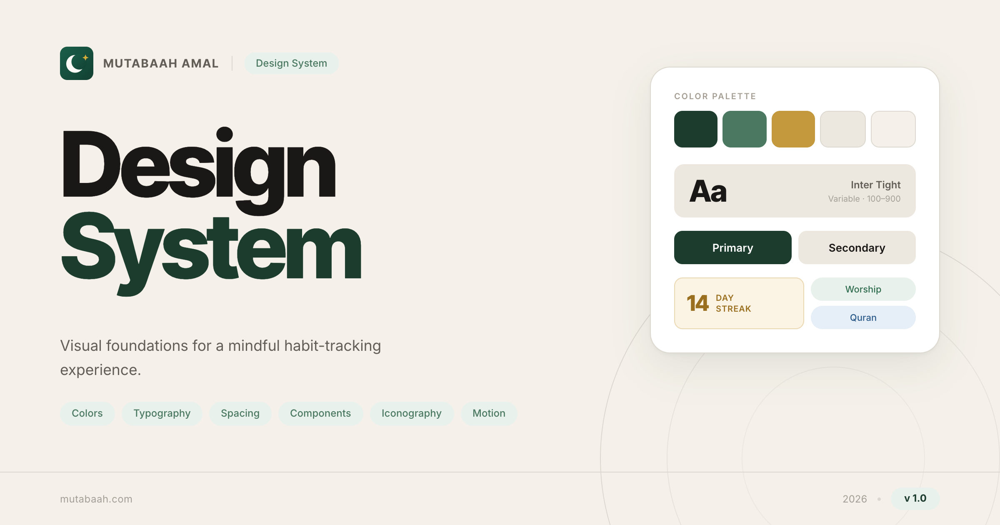

# Mutabaah Amal — Design System

A design system for **Mutabaah Amal**, an Islamic habit and amal tracking app. It documents all visual tokens, components, and interaction patterns used across the product.



## Overview

Edit source files directly and open `index.html` in a browser to browse the living style guide. Run `npm run build` to produce a minified production build. Pushing to `main` deploys automatically via GitHub Actions.

```
mutabaah-design-system/
├── index.html          # Design system documentation
├── styles.css          # All styles and design tokens
├── script.js           # Copy-to-clipboard, sticky nav, theme toggle, icon init
├── lucide-mini.js      # Self-hosted Lucide icon subset
├── build.js            # Production build script (outputs to docs/)
├── package.json        # Version source of truth + build dependencies
├── package-lock.json   # Lockfile (required for CI)
├── og-image.png        # Social share image (2400×1260px)
├── favicon-16x16.png
└── favicon-32x32.png
```

`docs/` is git-ignored — it is built and deployed by CI automatically.

## Development

```bash
# Browse locally
open index.html
# or serve with
npm run dev   # python3 -m http.server 8080

# Production build → docs/
npm run build
```

## Deployment

Every push to `main` triggers the GitHub Actions workflow (`.github/workflows/deploy.yml`) which:

1. Installs dependencies via `npm ci`
2. Runs `npm run build` to produce a minified `docs/` output
3. Deploys `docs/` to GitHub Pages

No manual build or push is required.

## Sections

| # | Section | What it covers |
|---|---------|----------------|
| 01 | **Typography** | Inter Tight (display), Inter (body) — full type scale |
| 02 | **Colors** | Core palette, category colors, and dark mode tokens |
| 03 | **Spacing** | Base spacing scale (4–80px), component and layout rhythm, border-radius tokens, elevation scale |
| 04 | **Iconography** | Lucide icon library — all icons grouped by category with usage guidance |
| 05 | **Components** | Buttons, chips, tags, input fields, progress rings, bar charts, streak badges |
| 06 | **Form Controls** | Checkbox, radio, and toggle — all states (default, checked, checked-disabled, disabled) |
| 07 | **Tasks** | Task item states (pending, done), metadata, and interaction notes |
| 08 | **Navigation** | Bottom tab bar and dashboard cards (hero card, Hijri date, streak) |
| 09 | **Empty States** | Three variants with illustration and copy guidelines |
| 10 | **Motion & Tone** | Transition durations, easing curves, animation principles, and copy guidelines |

## Design Tokens

All tokens live in the `:root` block at the top of `styles.css`. Dark mode overrides live in the `[data-theme="dark"]` block immediately below.

### Typography

| Font | Weights | Use |
|------|---------|-----|
| **Google Sans Flex** | 100–900 (variable) | Design system documentation — all text |
| **Inter Tight** | 400 / 500 / 600 / 700 / 800 | App display typeface — headings, large numerics |
| **Inter** | 300 / 400 / 500 / 600 | App body typeface — body text, labels, inputs |

All three fonts are loaded from Google Fonts in a single non-render-blocking request with metric-adjusted fallbacks to eliminate layout shift.

### Color Palette

| Token | Light | Dark | Role |
|-------|-------|------|------|
| `--bg` | `#F5F1EA` | `#18180F` | Page background |
| `--surface` | `#FFFFFF` | `#222219` | Card / component surface |
| `--surface-alt` | `#EDE8DF` | `#2D2D22` | Secondary surface, input fill |
| `--border` | `#DDD8CF` | `#3D3D2E` | Default border |
| `--primary` | `#1C3D2E` | `#4A9B70` | Primary action, brand green |
| `--sage` | `#46725B` | `#7AB89A` | Accent / secondary green |
| `--gold` | `#AC8636` | `#C9993D` | Streak, highlight |
| `--gold-dark` | `#90691E` | `#D9A84D` | Gold text on light backgrounds |
| `--gold-bg` | `#FBF3E3` | `#2A2416` | Gold tinted background |
| `--text-1` | `#1A1816` | `#F0EDE6` | Primary text |
| `--text-2` | `#635E56` | `#B5AFA6` | Secondary text |
| `--text-3` | `#6C6861` | `#888279` | Muted / placeholder text |
| `--success` | `#2D7A5A` | `#4A9B70` | Success states |
| `--error` | `#B84040` | `#E07070` | Error states |

### Category Colors

| Category | Token | Light | Dark |
|----------|-------|-------|------|
| Worship | `--cat-worship` / `--cat-worship-bg` | `#2D6E4E` / `#E8F2EC` | `#5DBB8A` / `#1A2E22` |
| Quran | `--cat-quran` / `--cat-quran-bg` | `#2E5D8C` / `#E6EEF7` | `#6B9ED4` / `#1A2230` |
| Charity | `--cat-charity` / `--cat-charity-bg` | `#AC8636` / `#FBF3E3` | `#C9993D` / `#2A2416` |
| Personal | `--cat-personal` / `--cat-personal-bg` | `#6E4A8C` / `#EFE9F7` | `#A87ED4` / `#221830` |

### Border Radius

| Token | Value | Use |
|-------|-------|-----|
| `--radius-xs` | `6px` | Small elements (code pills) |
| `--radius-sm` | `8px` | Small surfaces |
| `--radius-md` | `12px` | Buttons, input fields |
| `--radius-lg` | `16px` | Cards, list containers |
| `--radius-xl` | `20px` | Large cards, bottom nav |
| `--radius-2xl` | `24px` | Bottom sheets |
| `--radius-pill` | `100px` | Chips, tags, pill buttons |

### Elevation

| Token | Shadow | Use |
|-------|--------|-----|
| `--shadow-1` | `0 1px 4px rgba(28,61,46,0.06)` | Subtle — resting cards |
| `--shadow-2` | `0 2px 12px rgba(28,61,46,0.10)` | Raised — bottom sheets |
| `--shadow-3` | `0 4px 24px rgba(28,61,46,0.16)` | Elevated — overlapping panels |
| `--shadow-fab` | `0 4px 16px rgba(28,61,46,0.30)` | Floating action button |
| `--shadow-nav` | `0 -4px 24px rgba(28,61,46,0.06)` | Bottom navigation bar |

### Duration

| Token | Value | Use |
|-------|-------|-----|
| `--duration-fast` | `150ms` | Hover / state transitions |
| `--duration-exit` | `200ms` | Exits, dismissals |
| `--duration-enter` | `280ms` | Entrances, confirmations |
| `--duration-complete` | `360ms` | Task complete spring animation |

### Icons

| Library | Version | Method |
|---------|---------|--------|
| [Lucide](https://lucide.dev) | 0.460.0 | `<i data-lucide="icon-name"></i>` via `lucide-mini.js` |

Icons are initialised on page load via `lucide.createIcons()` in `script.js`.

## Versioning

Version and build date are single-sourced:

- **Version** is set once in `package.json`
- **Date** is derived from the build timestamp automatically

Running `npm run build` propagates both into `script.js` (for the dev server) and into the minified HTML output. To release a new version, update `package.json` and push — CI handles the rest.

## Dark Mode

The design system ships with a full dark mode. A moon/sun toggle in the sticky nav switches themes. The preference is persisted in `localStorage` and respects the OS `prefers-color-scheme` setting on first visit.

All dark mode tokens are defined in `[data-theme="dark"]` in `styles.css`.

## Interactive Features

| Feature | Notes |
|---------|-------|
| Copy hex / CSS variable | Click any colour swatch in the Colors section |
| Copy token | Click any radius, shadow, or duration token |
| Copy icon name | Click any icon card in the Iconography section |
| Dark mode toggle | Moon/sun button in the sticky nav; persists across visits |
| Sticky nav highlighting | Active section highlighted as you scroll |

Clipboard writes use the `navigator.clipboard` API exclusively.

## Responsive Breakpoints

| Breakpoint | Width | Notes |
|------------|-------|-------|
| Desktop | > 900px | Full layout, 6-column colour grid |
| Tablet | ≤ 900px | Reduced padding, single-column font cards |
| Mobile | ≤ 640px | Scrollable nav strip, compact layout |
| Small phones | ≤ 380px | Smaller hero type |

## Contributing

| File | Purpose |
|------|---------|
| `index.html` | Structure, content, and meta tags |
| `styles.css` | All styles and CSS custom property tokens |
| `script.js` | Interactive behaviour — clipboard, nav, theme toggle, version |
| `build.js` | Production build script |
| `package.json` | Version source of truth |

To update design tokens, edit the `:root` block in `styles.css`. To add sections or components, edit `index.html` and add corresponding styles to `styles.css`. To replace the social share image, swap `og-image.png` (keep at 2400×1260px).
