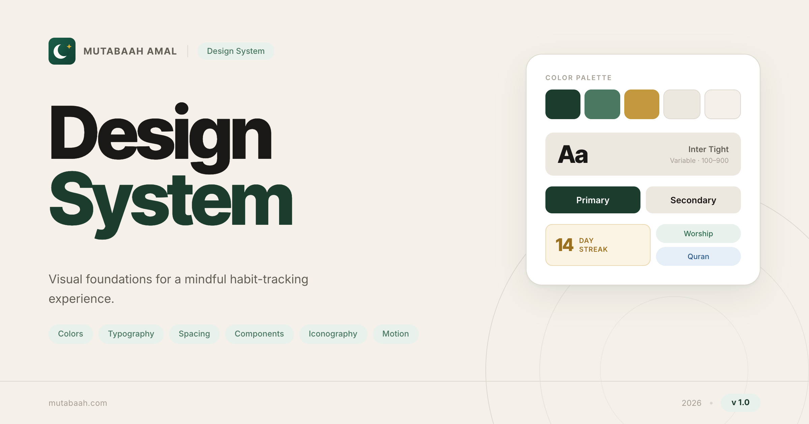

# Mutabaah Amal — Design System

**Grounded in calm, reverent minimalism with Islamic warmth.**

A comprehensive design system for **Mutabaah Amal**, an Islamic habit and amal tracking app. This project documents all visual tokens, interactive components, and specialized patterns that define the product experience.



## Overview

The design system is built with zero dependencies for the runtime, prioritizing performance, accessibility, and high-fidelity motion.

### Core Architecture
- **Documentation:** Built on a single `index.html` for instant accessibility and ease of maintenance.
- **Styling:** Vanilla CSS using a deep hierarchy of Design Tokens (CSS Variables).
- **Interactivity:** Lightweight Vanilla JS with specialized modules for search, accessibility, and clipboard management.
- **Build Pipeline:** Node.js-based minification, content-hashing, and an automated image optimization pipeline using `sharp`.

```
mutabaah-design-system/
├── src/                # Source code (CSS/JS)
├── index.html          # Documentation markup
├── build.js            # Production build script
├── sync-version.js     # Version synchronization utility
├── package.json        # Project manifest
└── README.md
```

## Development

### Prerequisites
- Node.js (Latest LTS recommended)
- `npm`

### Quick Start
```bash
# 1. Install dependencies
npm install

# 2. Run development server (live-reloading on port 8080)
npm run dev

# 3. Build for production (outputs to docs/)
npm run build
```

## Deployment

The project is automatically deployed via GitHub Actions. Every push to `main` triggers:
1. `npm ci` to install dependencies.
2. `npm run build` to generate the production-ready `docs/` folder.
3. Deployment of `docs/` to GitHub Pages.

## Build Pipeline

The `build.js` script handles optimization for production readiness:
- **Minification:** Uses `lightningcss` (CSS) and `esbuild` (JS).
- **Content Hashing:** JavaScript files are hashed for efficient browser caching.
- **Image Optimization:** 
    - Automatically generates modern WebP/AVIF formats from `og-image.png`.
    - Creates a full set of favicon/PWA icons from `logo.svg`.
- **Inlining:** Minifies and inlines critical assets where appropriate.

## Contributing

We welcome contributions! To ensure consistency, please adhere to the following:

1. **Design Tokens:** Edit CSS variables in the `:root` block of `styles.css`.
2. **Components:** Group styles logically. Consider creating a `/src/components` directory for modular styles.
3. **Documentation:** Keep `index.html` updated with new component states or token changes.
4. **Versioning:** Use `npm version [patch|minor|major]` to trigger `sync-version.js` and keep project files in sync.

## License

[Add your license here, e.g., MIT]
